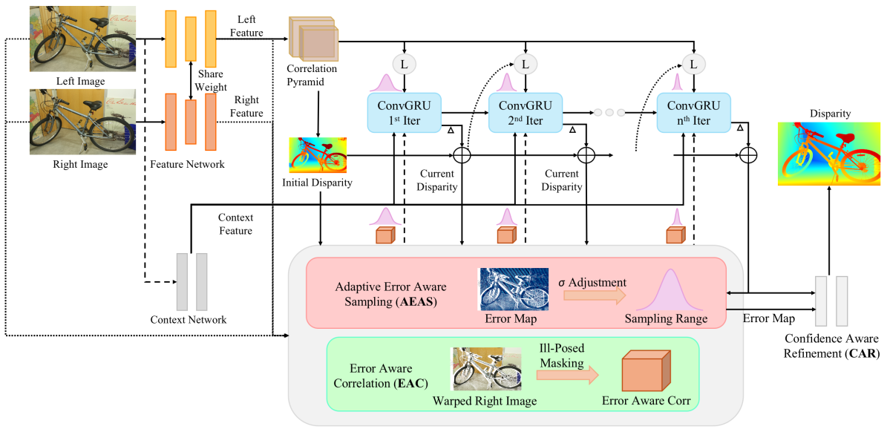
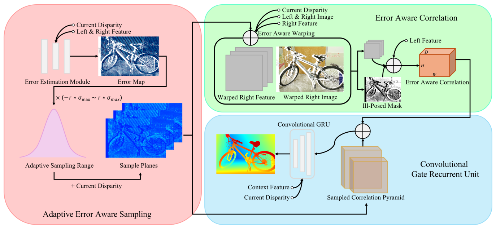
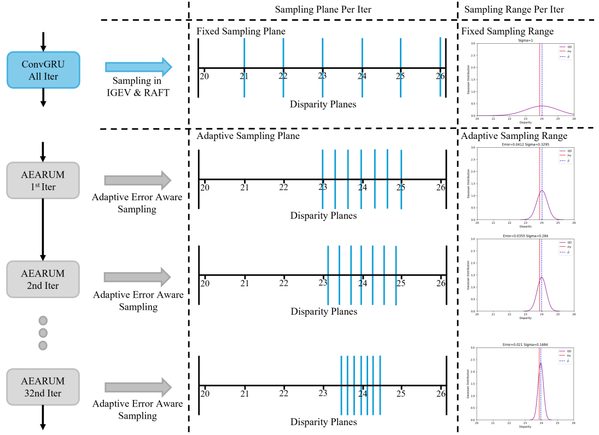
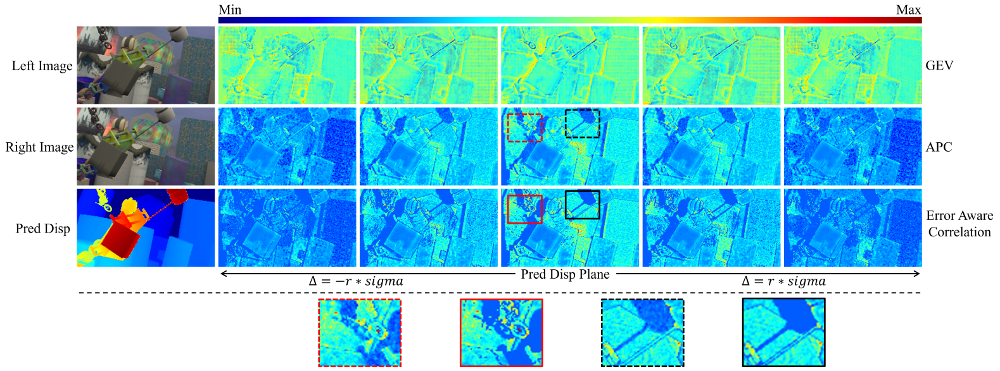
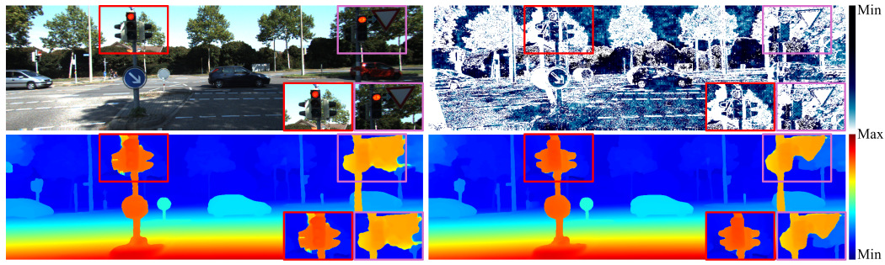
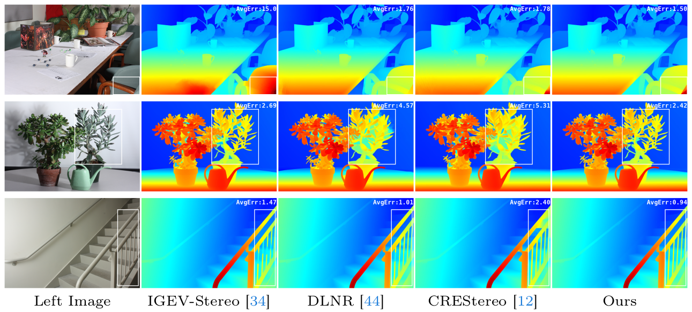
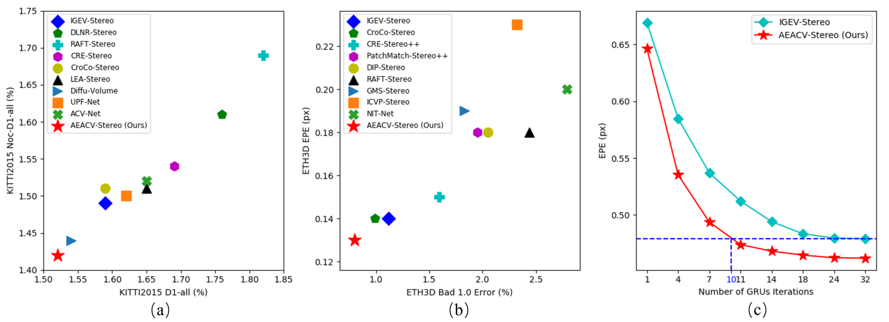
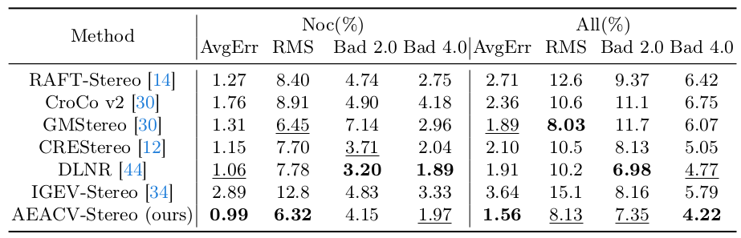

# :star: AEACV-Stereo (ECCV 2024 Submission ID 4123) :star:

:warning: **Warning: This paper has not been accepted by the main conference of ECCV 2024. Due to company policy, it has not been republished in any other conferences or workshops, nor has it been published on arXiv. If you have any problems, feel free to contact us by email [:email:](mailto:jiahali2-c@my.cityu.edu.hk).**

This repository contains the source code for our paper.

**Adaptive Error Aware Cost Volume for Stereo Matching (AEACV-Stereo)**

Jiahao LI, Zhengxin LI, Yiping Bao, Guangyuan Zhou, Qiang Rao, Xiao Liu

<p align="center"></p>
<div align="center">
  </img>
</div>
<p></p>
<p align="center"></p>

<p align="center"></p>
<div align="center">
  </img>
</div>
<p></p>
<p align="center"></p>

## :bulb: Abstract
Stereo matching, a fundamental challenge in computer vision, has seen remarkable achievements through iterative mechanisms such as RAFT-Stereo and IGEV-Stereo. However, these methods still underperform in ill-posed regions, such as those with occlusions and challenging textures, due to a lack of sufficiently effective motion information in the correlations for these areas to support iterative refinement. How to employ a more rational iterative sampling strategy when obtaining sampled correlations is a question that warrants further investigation. This paper introduces the **A**daptive **E**rror **A**ware **C**ost **V**olume (**AEACV**), which addresses these challenges by integrating the following two modules: 1. Adaptive Error Aware Sampling (AEAS) module dynamically adjusts the sampling range by estimating the error map, effectively optimizing the convergence speed during the disparity estimation process. 2. Error Aware Correlation (EAC) technique that excludes ill-posed regions from cost-volume significantly improves the accuracy of stereo matching. The effectiveness of AEACV-Stereo is validated through extensive experiments, showcasing its superior performance in various scenarios, including those with challenging occlusions. Our method (AEACV-Stereo) ranks first on KITTI 2015, Middlebury, and ETH3D, surpassing existing published methods. It achieves comparable accuracy by utilizing just one-third of the cost volume sampling iterations. Additionally, our method outperforms existing works in zero-shot generalization capabilities across various datasets.

**Our main contributions are:**
- We present a dynamic sampling strategy based on an error map, significantly accelerating iterative speed.
- We introduce a cost volume construction method that effectively filters out noise from ill-posed regions, enhancing the accuracy of disparity prediction.
- Our method has demonstrated its effectiveness by outperforming existing methods across various public benchmarks, reinforcing the practicality and potential impact of our approach.

## :brain: Core Technique
<p align="center"></p>
<div align="center">
  </img>
</div>
<p></p>

The visualization of Adaptive Error Aware Sampling (AEAS). Our AEAS can adjust the sampling range dynamically compared with the fixed sampling range in current iterative stereo matching methods during iterations. Once the predicted disparity is more accurate, the sampling range will be shrunk to avoid unnecessary noise. Meanwhile, if the predicted disparity is less accurate, the sampling range will be expanded to introduce more information.

<p align="center"></p>
<div align="center">
  </img>
</div>
<p></p>

The visualization of Error Aware Correlation (EAC). Our EAC can avoid the noise in occlusion regions clearly and more consistently compared with APC and GEV.

## :clapper: Results
<p align="center"></p>
<div align="center">
  </img>
</div>
<p></p>

Qualitative results of AEACV-Stereo on the KITTI 2015 test set. **Up-Left**: Input Left Image. **Up-Right**: Generated Error Aware Mask. **Bottom-Left**: Disparity Predicted by IGEV-Stereo. **Bottom-Right**: Disparity Predicted by AEACV-Stereo.

<p align="center"></p>
<div align="center">
  </img>
</div>
<p></p>

Qualitative results of AEACV-Stereo on the Middlebury test set.

<p align="center"></p>
<div align="center">
  </img>
</div>
<p></p>

<p align="center"></p>
<div align="center">
  </img>
</div>
<p></p>

Qualitative results of the proposed AEACV-Stereo compared with state-of-the-art stereo methods on different public benchmarks and KITTI 2015 leaderboards.

## :gear: Environment Settings

* NVIDIA A100
* python 3.8

```Shell
conda create -n aeacv python=3.8
conda activate aeacv

pip install torch==2.0.1 torchvision==0.15.2 torchaudio==2.0.2 --index-url https://download.pytorch.org/whl/cu118
pip install tqdm==4.67.1
pip install scipy==1.10.1
pip install opencv-python==4.11.0.86
pip install scikit-image==0.21.0
pip install tensorboard==2.12.0
pip install matplotlib==3.7.5
pip install timm==0.5.4
pip install numpy==1.24.1
pip install einops==0.8.1
```

## :floppy_disk: Required Data

* [SceneFlow](https://lmb.informatik.uni-freiburg.de/resources/datasets/SceneFlowDatasets.en.html)
* [KITTI](https://www.cvlibs.net/datasets/kitti/eval_scene_flow.php?benchmark=stereo)
* [ETH3D](https://www.eth3d.net/datasets)
* [Middlebury](https://vision.middlebury.edu/stereo/submit3/)
* [TartanAir](https://github.com/castacks/tartanair_tools)
* [VKITTI2](https://europe.naverlabs.com/research/proxy-virtual-worlds/)
* [CREStereo Dataset](https://github.com/megvii-research/CREStereo)
* [FallingThings](https://research.nvidia.com/publication/2018-06_falling-things-synthetic-dataset-3d-object-detection-and-pose-estimation)
* [InStereo2K](https://github.com/YuhuaXu/StereoDataset)
* [Sintel Stereo](http://sintel.is.tue.mpg.de/stereo)
* [HR-VS](https://drive.google.com/file/d/1SgEIrH_IQTKJOToUwR1rx4-237sThUqX/view)

## :test_tube: Evaluation
1. Download the Checkpoints from [Google Drive](https://drive.google.com/drive/folders/1pNtfWhew2u6fHOGxPnHN2SRxWNzx2Udl?usp=drive_link).

2. Run the evaluation with the following code (e.g. Evaluation of AEACV-Stereo on Scene Flow test set).
```Shell
python3 evaluate_aeacv_stereo.py --restore_ckpt your/path/to/checkpoints --dataset sceneflow
```

## :books: Training
1. Change the following parameters in the script named `train_aeacv_sceneflow.sh`.
    - `logdir`
      - your/path/to/save/training/information
2. Run the training (e.g. Training of AEACV-Stereo on Scene Flow test set).
```Shell
./train_aeacv_sceneflow.sh
```

## :package: Submission
Run the following submission code for AEACV-Stereo.
```Shell
python3 aeacv_submission.py --restore_ckpt your/path/to/checkpoints --dataset ["eth3d", "kitti", "middlebury_{Q|H|F}"]
```

## Acknowledgements
This project is based on [RAFT-Stereo](https://github.com/princeton-vl/RAFT-Stereo) and [IGEV-Stereo](https://github.com/gangweix/IGEV). We thank the original authors for their excellent work.
